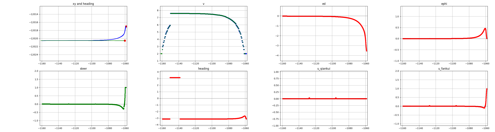
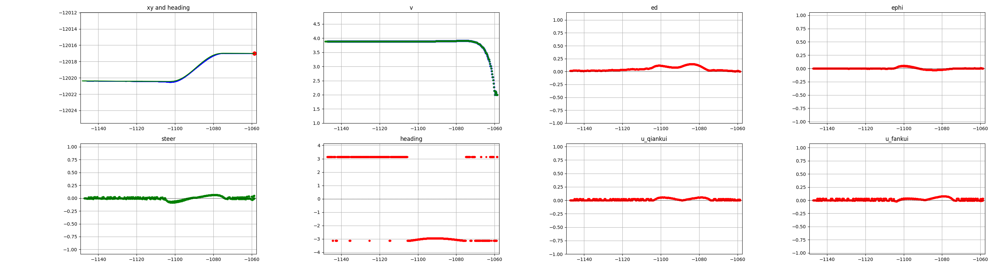

## 项目文件说明
### Dynamics_model.py
车辆动力学模型文件

**依次说明需要初始化的参数：**

质量m

前轴总侧偏刚度Cf

后轴总侧偏刚度Cr

初始纵向速度vx

质心到前轴距离a

质心到后轴距离b

车辆轴距L=a+b

车辆绕z轴转动惯量Iz

车辆初始横摆角 phi_init（-pi to pi）

车辆初始横摆角速度 d_phi_init

车辆初始横向速度vy_init

仿真步长T

车辆初始坐标x0,y0

车辆初始转向盘角度

`def update(self, delta_f):`

update方法接收一个前轮转角值用于更新车辆自身状态

### generate_path.py

generate_path 文件中提供的 Path 类，初始化时接收一个txt类型文件名，该文件是提前准备好的规划轨迹文件，第一到第四列分别为：

车辆规划x坐标，车辆规划y坐标，车辆规划航向角，车辆规划纵向速度。

### pid_lon.py
该文件提供纵向速度pid控制算法，初始化需要pid的三个权重以及仿真步长
pid_lon 方法接收当前车辆纵向速度与目标纵向速度，并输出加速度控制量

### visual.py
该文件提供可视化，初始化需传入车辆模型、规划路径、lqr算法

### 具体demo请参考main.py
仿真完成后可视化如图所示：

直线跟踪效果：

单移线跟踪效果：

xy and heading 图中红色点表示起点，绿色线为规划轨迹，蓝色为实际跟踪轨迹